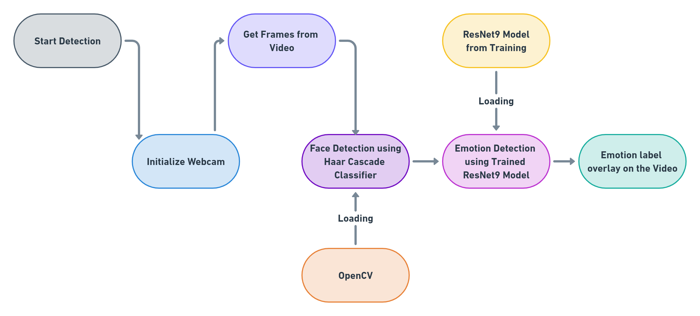

# Emotion-Detection-OpenCV-Pytorch-ResNet9

In this Project, A ResNet9 architecture based model was trained on a Dataset containing 28000+ images spreaded across 7 different classes of emotions.
And then the Model was used in a Real Time Application made using Tkinter.

Dataset link - https://www.kaggle.com/datasets/de270025c781ba47a3a6d774a0d670452bfb4dc9d2d6b13740cdb0c17aa7bf2b

I have used the Model architecture and code from https://github.com/Conero007/Emotion-Detection-Pytorch Repository which was trained on 5 Classes.

* So I trained it on 7 Classes - Anger, Disgust, Fear, Happy, Neutral, Sad and Surprise with 28709 images
* Added System Structure
* Added Complete Workflow
* Added ResNet9 Architecture
* Added Confusion Matrix
* Added Classification Report

# GUI

# Design Methodology
## System Structure

## Complete Workflow of the System

## ResNet9 Detailed Architecture

# Authors of the Dataset
@MISC{Goodfeli-et-al-2013,
       author = {Goodfellow, Ian and Erhan, Dumitru and Carrier, Pierre-Luc and Courville, Aaron and Mirza, Mehdi and Hamner, Ben and Cukierski, Will and Tang, Yichuan and Thaler, David and Lee, Dong-Hyun and Zhou, Yingbo and Ramaiah, Chetan and Feng, Fangxiang and Li, Ruifan and Wang, Xiaojie and Athanasakis, Dimitris and Shawe-Taylor, John and Milakov, Maxim and Park, John and Ionescu, Radu and Popescu, Marius and Grozea, Cristian and Bergstra, James and Xie, Jingjing and Romaszko, Lukasz and Xu, Bing and Chuang, Zhang and Bengio, Yoshua},
     keywords = {competition, dataset, representation learning},
        title = {Challenges in Representation Learning: A report on three machine learning contests},
         year = {2013},
  institution = {Unicer},
          url = {http://arxiv.org/abs/1307.0414},
     abstract = {The ICML 2013 Workshop on Challenges in Representation
Learning focused on three challenges: the black box learning challenge,
the facial expression recognition challenge, and the multimodal learn-
ing challenge. We describe the datasets created for these challenges and
summarize the results of the competitions. We provide suggestions for or-
ganizers of future challenges and some comments on what kind of knowl-
edge can be gained from machine learning competitions.

http://deeplearning.net/icml2013-workshop-competition}
}
